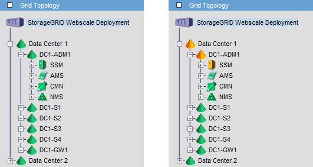

= Affichage des alarmes acquittées par les nœuds d'administration (système hérité)
:allow-uri-read: 
:icons: font
:imagesdir: ../media/

[role="lead"]
Lorsque vous accusez réception d'une alarme sur un nœud d'administration, l'alarme acquittée n'est copiée sur aucun autre nœud d'administration. Étant donné que les accusés de réception ne sont pas copiés sur d'autres nœuds d'administration, l'arborescence de la topologie de la grille peut ne pas être identique pour chaque nœud d'administration.

Cette différence peut être utile lors de la connexion de clients Web. Les clients Web peuvent avoir différentes vues du système StorageGRID selon les besoins de l'administrateur.

Notez que les notifications sont envoyées depuis le nœud d'administration où l'accusé de réception a lieu.
