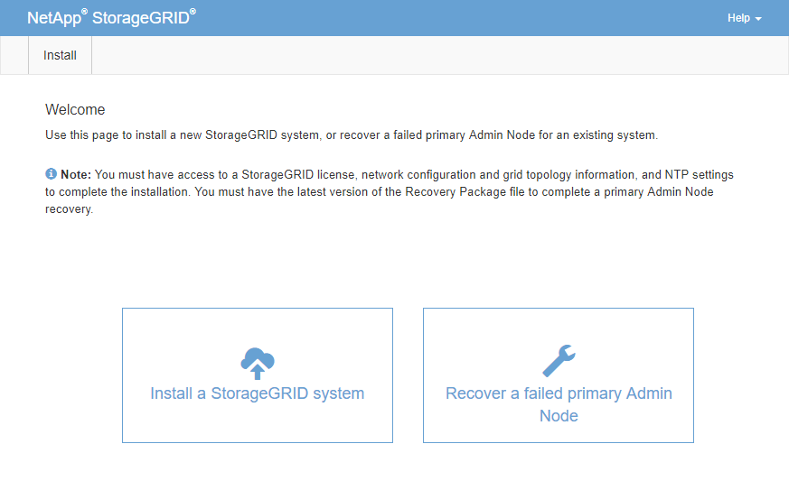

= Configurez le nœud d'administration principal de remplacement
:allow-uri-read: 
:icons: font
:imagesdir: ../media/

[role="lead"]
Le nœud de remplacement doit être configuré en tant que nœud d'administration principal de votre système StorageGRID.

.Avant de commencer
* Pour les nœuds d'administration principaux hébergés sur des machines virtuelles, la machine virtuelle a été déployée, mise sous tension et initialisée.
* Pour les nœuds d'administration primaires hébergés sur une appliance de services, vous avez remplacé l'appliance et installé le logiciel. Voir la https://docs.netapp.com/us-en/storagegrid-appliances/installconfig/index.html["instructions d'installation de votre appareil"^].
* Vous disposez de la dernière sauvegarde du fichier du progiciel de récupération (`sgws-recovery-package-_id-revision_.zip`).
* Vous avez la phrase secrète pour le provisionnement.

.Étapes
. Ouvrez votre navigateur Web et accédez à `\https://primary_admin_node_ip`.
+

. Cliquez sur *récupérer un noeud d'administration principal ayant échoué*.
. Téléchargez la sauvegarde la plus récente du progiciel de restauration :
+
.. Cliquez sur *Parcourir*.
.. Recherchez le fichier de progiciel de récupération le plus récent pour votre système StorageGRID et cliquez sur *Ouvrir*.

. Saisissez la phrase secrète pour le provisionnement.
. Cliquez sur *Démarrer la récupération*.
+
Le processus de récupération commence. Le Grid Manager peut devenir indisponible pendant quelques minutes lorsque les services requis démarrent. Une fois la récupération terminée, la page de connexion s'affiche.

. Si l'authentification unique (SSO) est activée pour votre système StorageGRID et que l'approbation du composant de confiance pour le nœud d'administration que vous avez récupéré a été configurée pour utiliser le certificat d'interface de gestion par défaut, mettre à jour (ou supprimer et recréer) l'approbation du nœud dans Active Directory Federation Services (AD FS). Utilisez le nouveau certificat de serveur par défaut qui a été généré pendant le processus de restauration du noeud d'administration.
+

NOTE: Pour configurer une confiance de partie utilisatrice, reportez-vous à la section link:../admin/configuring-sso.html["Configurer l'authentification unique"]. Pour accéder au certificat de serveur par défaut, connectez-vous au shell de commande du noeud d'administration. Accédez au `/var/local/mgmt-api` et sélectionnez `server.crt` fichier.

. Déterminez si vous devez appliquer un correctif.
+
.. Connectez-vous au Grid Manager à l'aide d'un link:../admin/web-browser-requirements.html["navigateur web pris en charge"].
.. Sélectionnez *NOEUDS*.
.. Dans la liste de gauche, sélectionnez le nœud d'administration principal.
.. Dans l'onglet vue d'ensemble, notez la version affichée dans le champ *version du logiciel*.
.. Sélectionnez un autre nœud de grille.
.. Dans l'onglet vue d'ensemble, notez la version affichée dans le champ *version du logiciel*.
+
*** Si les versions affichées dans les champs *version du logiciel* sont identiques, vous n'avez pas besoin d'appliquer un correctif.
*** Si les versions affichées dans les champs *version du logiciel* sont différentes, vous devez le faire link:storagegrid-hotfix-procedure.html["appliquer un correctif"] Pour mettre à jour le nœud d'administration principal restauré vers la même version.

