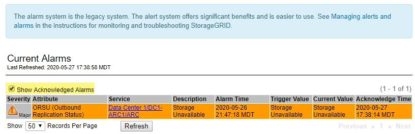

= Gestion des alarmes (système hérité)
:allow-uri-read: 
:icons: font
:imagesdir: ../media/

[role="lead"]
Le système d'alarme StorageGRID est l'ancien système utilisé pour identifier les points de défaillance qui se produisent parfois pendant le fonctionnement normal.

NOTE: Bien que le système d'alarme existant continue d'être pris en charge, le système d'alerte offre des avantages significatifs et est plus facile à utiliser.

== Classes d'alarme (système hérité)

Une alarme héritée peut appartenir à l'une des deux classes d'alarme mutuellement exclusives.

* Les alarmes par défaut sont fournies avec chaque système StorageGRID et ne peuvent pas être modifiées. Vous pouvez cependant désactiver les alarmes par défaut ou les remplacer en définissant les alarmes personnalisées globales.
* Les alarmes personnalisées globales contrôlent l'état de tous les services d'un type donné dans le système StorageGRID. Vous pouvez créer une alarme personnalisée globale pour remplacer une alarme par défaut. Vous pouvez également créer une nouvelle alarme personnalisée globale. Cela peut être utile pour la surveillance de toutes les conditions personnalisées de votre système StorageGRID.

== Logique de déclenchement d'alarme (système hérité)

Une alarme héritée est déclenchée lorsqu'un attribut StorageGRID atteint une valeur de seuil qui évalue à TRUE par rapport à une combinaison de classe d'alarme (personnalisée par défaut ou personnalisé global) et de niveau de gravité d'alarme.

[cols="1a,1a,1a,3a"]
|===
| Icône | Couleur | Gravité de l'alarme | Signification 

 a| 
image:../media/icon_alarm_yellow_notice.gif["icône carrée jaune"]
 a| 
Jaune
 a| 
Avertissement
 a| 
Le nœud est connecté à la grille, mais il existe une condition inhabituelle qui n'affecte pas les opérations normales.

 a| 
image:../media/icon_alert_yellow_minor.png["icône orange clair en forme de losange"]
 a| 
Orange clair
 a| 
Mineur
 a| 
Le nœud est connecté à la grille, mais il existe une condition anormale qui pourrait affecter son fonctionnement à l'avenir. Vous devez étudier pour éviter la remontée des problèmes.

 a| 
image:../media/icon_alert_orange_major.png["icône losange orange foncé"]
 a| 
Orange foncé
 a| 
Majeur
 a| 
Le nœud est connecté à la grille, mais il existe une condition anormale qui affecte actuellement le fonctionnement. Cela nécessite une attention particulière afin d'éviter la remontée des problèmes.

 a| 
image:../media/icon_alert_red_critical.png["icône x rouge"]
 a| 
Rouge
 a| 
Primordial
 a| 
Le nœud est connecté à la grille, mais il existe une condition anormale qui a arrêté des opérations normales. Vous devez résoudre le problème immédiatement.

|===
La gravité de l'alarme et la valeur de seuil correspondante peuvent être définies pour chaque attribut numérique. Le service NMS sur chaque noeud d'administration surveille en permanence les valeurs d'attribut actuelles par rapport aux seuils configurés. Lorsqu'une alarme est déclenchée, une notification est envoyée à tout le personnel désigné.

Notez qu'un niveau de gravité Normal ne déclenche pas d'alarme.

Les valeurs d'attribut sont évaluées par rapport à la liste des alarmes activées définies pour cet attribut. La liste des alarmes est vérifiée dans l'ordre suivant pour trouver la première classe d'alarme avec une alarme définie et activée pour l'attribut :

. Alarmes personnalisées globales avec niveaux de gravité d'alarme allant de critique à avertissement.
. Alarmes par défaut avec niveaux de gravité d'alarme de critique à avertissement.

Une fois qu'une alarme activée pour un attribut est détectée dans la classe d'alarme supérieure, le service NMS ne s'évalue qu'au sein de cette classe. Le service NMS ne s'évalue pas par rapport aux autres catégories de priorité inférieure. En d'autres termes, si une alarme personnalisée globale est activée pour un attribut, le service NMS évalue uniquement la valeur de l'attribut par rapport aux alarmes personnalisées globales. Les alarmes par défaut ne sont pas évaluées. Ainsi, une alarme par défaut activée pour un attribut peut répondre aux critères requis pour déclencher une alarme, mais elle ne sera pas déclenchée car une alarme personnalisée globale (qui ne répond pas aux critères spécifiés) pour le même attribut est activée. Aucune alarme n'est déclenchée et aucune notification n'est envoyée.

=== Exemple de déclenchement d'alarme

Cet exemple permet de comprendre comment les alarmes personnalisées globales et les alarmes par défaut sont déclenchées.

Pour l'exemple suivant, un attribut possède une alarme personnalisée globale et une alarme par défaut définie et activée, comme indiqué dans le tableau suivant.

[cols="1a,2a,2a"]
|===
|  | Seuil d'alarme personnalisé global (activé) | Seuil d'alarme par défaut (activé) 

 a| 
Avertissement
 a| 
>= 1500
 a| 
>= 1000

 a| 
Mineur
 a| 
>= 15,000
 a| 
>= 1000

 a| 
Majeur
 a| 
>=150,000
 a| 
>= 250,000

|===
Si l'attribut est évalué lorsque sa valeur est 1000, aucune alarme n'est déclenchée et aucune notification n'est envoyée.

L'alarme personnalisée globale est prioritaire sur l'alarme par défaut. Une valeur de 1000 n'atteint pas la valeur seuil d'un niveau de gravité quelconque pour l'alarme personnalisée globale. Par conséquent, le niveau d'alarme est évalué à Normal.

Après le scénario ci-dessus, si l'alarme personnalisée globale est désactivée, rien ne change. La valeur de l'attribut doit être réévaluée avant qu'un nouveau niveau d'alarme ne soit déclenché.

Lorsque l'alarme personnalisée globale est désactivée, lorsque la valeur de l'attribut est réévaluée, la valeur de l'attribut est évaluée par rapport aux valeurs de seuil de l'alarme par défaut. Le niveau d'alarme déclenche une alarme de niveau d'avertissement et une notification par e-mail est envoyée au personnel désigné.

=== Alarmes de même gravité

Si deux alarmes globales personnalisées pour le même attribut ont la même gravité, les alarmes sont évaluées avec une priorité « supérieure vers le bas ».

Par exemple, si UMEM tombe à 50 Mo, la première alarme est déclenchée (= 50000000), mais pas celle en dessous (\<=100000000).

image::../media/alarm_order.gif[Exemple d'alarme personnalisée globale]

Si l'ordre est inversé, lorsque UMEM tombe à 100 Mo, la première alarme (\<=100000000) est déclenchée, mais pas celle en dessous (= 50000000).

image::../media/alarm_order_reversed.gif[Exemple d'alarme personnalisée globale]

=== Notifications

Une notification signale l'occurrence d'une alarme ou le changement d'état d'un service. Les notifications d'alarme peuvent être envoyées par e-mail ou via SNMP.

Pour éviter l'envoi de plusieurs alarmes et notifications lorsqu'une valeur de seuil d'alarme est atteinte, la gravité de l'alarme est vérifiée par rapport à la gravité actuelle de l'alarme pour l'attribut. S'il n'y a pas de changement, aucune autre action n'est entreprise. Cela signifie que, lorsque le service NMS continue à surveiller le système, il déclenche une alarme et envoie des notifications la première fois qu'il remarque une condition d'alarme pour un attribut. Si un nouveau seuil de valeur pour l'attribut est atteint et détecté, la gravité de l'alarme change et une nouvelle notification est envoyée. Les alarmes sont effacées lorsque les conditions reviennent au niveau Normal.

La valeur de déclenchement indiquée dans la notification d'un état d'alarme est arrondie à trois décimales. Par conséquent, une valeur d'attribut de 1.9999 déclenche une alarme dont le seuil est inférieur à (<) 2.0, bien que la notification d'alarme indique la valeur de déclenchement comme 2.0.

=== Nouveaux services

Lorsque de nouveaux services sont ajoutés par l'ajout de nouveaux nœuds ou sites de grille, ils héritent des alarmes par défaut et des alarmes personnalisées globales.

=== Alarmes et tableaux

Les attributs d'alarme affichés dans les tableaux peuvent être désactivés au niveau du système. Les alarmes ne peuvent pas être désactivées pour des lignes individuelles d'une table.

Par exemple, le tableau suivant montre deux entrées critiques disponibles (VMFI) alarmes. (Sélectionnez *SUPPORT* > *Outils* > *topologie de grille*. Sélectionnez ensuite *_Storage Node_* > *SSM* > *Resources*.)

Vous pouvez désactiver l'alarme VMFI de sorte que l'alarme VMFI de niveau critique ne soit pas déclenchée (les deux alarmes critiques actuelles apparaissent en vert dans le tableau) ; Cependant, vous ne pouvez pas désactiver une seule alarme dans une ligne de table de sorte qu'une alarme VMFI s'affiche comme une alarme de niveau critique alors que l'autre reste verte.

image::../media/disabling_alarms.gif[Page volumes affichant les alarmes critiques]

== Acquitter les alarmes actuelles (système hérité)

Les alarmes héritées sont déclenchées lorsque les attributs système atteignent les valeurs de seuil d'alarme. Si vous souhaitez réduire ou effacer la liste des alarmes existantes, vous pouvez également accuser réception des alarmes.

.Avant de commencer
* Vous devez être connecté au Grid Manager à l'aide d'un link:../admin/web-browser-requirements.html["navigateur web pris en charge"].
* Vous devez disposer de l'autorisation d'acquittement des alarmes.

.Description de la tâche
Comme le système d'alarme existant continue d'être pris en charge, la liste des alarmes existantes sur la page alarmes en cours est augmentée chaque fois qu'une nouvelle alarme se déclenche. Vous pouvez généralement ignorer les alarmes (car les alertes offrent une meilleure vue du système) ou vous pouvez acquitter les alarmes.

NOTE: En option, lorsque vous avez effectué une transition complète vers le système d'alerte, vous pouvez désactiver chaque alarme existante pour l'empêcher d'être déclenchée et ajoutée au nombre d'alarmes existantes.

Lorsque vous reconnaissez une alarme, elle ne figure plus dans la page alarmes en cours du Gestionnaire de grille, sauf si l'alarme est déclenchée au niveau de gravité suivant ou si elle est résolue et se déclenche à nouveau.

NOTE: Bien que le système d'alarme existant continue d'être pris en charge, le système d'alerte offre des avantages significatifs et est plus facile à utiliser.

.Étapes
. Sélectionnez *SUPPORT* > *alarmes (hérité)* > *alarmes actuelles*.
+
image::../media/current_alarms_page.png[Page alarmes en cours]

. Sélectionnez le nom du service dans le tableau.
+
L'onglet alarmes du service sélectionné apparaît (*SUPPORT* > *Outils* > *topologie de grille* > *_Grid Node_* > *_Service_* > *alarmes*).

+
image::../media/alarms_acknowledging.png[Acquittement des alarmes]

. Cochez la case *Acknowledge* pour l'alarme, puis cliquez sur *Apply Changes*.
+
L'alarme n'apparaît plus sur le tableau de bord ou sur la page alarmes actuelles.

+

NOTE: Lorsque vous reconnaissez une alarme, l'accusé de réception n'est pas copié sur d'autres nœuds d'administration. Par conséquent, si vous affichez le tableau de bord à partir d'un autre nœud d'administration, vous pouvez continuer à voir l'alarme active.

. Si nécessaire, affichez les alarmes acquittées.
+
.. Sélectionnez *SUPPORT* > *alarmes (hérité)* > *alarmes actuelles*.
.. Sélectionnez *Afficher les alarmes acquittées*.
+
Toutes les alarmes acquittées sont affichées.

+

== Afficher les alarmes par défaut (système hérité)

Vous pouvez afficher la liste de toutes les alarmes héritées par défaut.

.Avant de commencer
* Vous devez être connecté au Grid Manager à l'aide d'un link:../admin/web-browser-requirements.html["navigateur web pris en charge"].
* Vous avez link:../admin/admin-group-permissions.html["autorisations d'accès spécifiques"].

NOTE: Bien que le système d'alarme existant continue d'être pris en charge, le système d'alerte offre des avantages significatifs et est plus facile à utiliser.

.Étapes
. Sélectionnez *SUPPORT* > *alarmes (hérité)* > *alarmes globales*.
. Pour Filtrer par, sélectionnez *Code d'attribut* ou *Nom d'attribut*.
. Pour Egal, entrez un astérisque : `*`
. Cliquez sur la flèche image:../media/icon_nms_right_arrow.gif["Icône de flèche"] Ou appuyez sur *entrée*.
+
Toutes les alarmes par défaut sont répertoriées.

+
image::../media/global_alarms.gif[Page alarmes globales]

== Examiner les alarmes historiques et la fréquence des alarmes (système hérité)

Lors du dépannage d'un problème, vous pouvez vérifier la fréquence à laquelle une alarme héritée a été déclenchée par le passé.

.Avant de commencer
* Vous devez être connecté au Grid Manager à l'aide d'un link:../admin/web-browser-requirements.html["navigateur web pris en charge"].
* Vous avez link:../admin/admin-group-permissions.html["autorisations d'accès spécifiques"].

NOTE: Bien que le système d'alarme existant continue d'être pris en charge, le système d'alerte offre des avantages significatifs et est plus facile à utiliser.

.Étapes
. Procédez comme suit pour obtenir une liste de toutes les alarmes déclenchées sur une période donnée.
+
.. Sélectionnez *SUPPORT* > *alarmes (hérité)* > *alarmes historiques*.
.. Effectuez l'une des opérations suivantes :
+
*** Cliquez sur l'une des périodes.
*** Entrez une plage personnalisée, puis cliquez sur *requête personnalisée*.

. Procédez comme suit pour découvrir la fréquence à laquelle les alarmes ont été déclenchées pour un attribut particulier.
+
.. Sélectionnez *SUPPORT* > *Outils* > *topologie de grille*.
.. Sélectionnez *_grid node_* > *_service ou composant_* > *alarmes* > *Historique*.
.. Sélectionnez l'attribut dans la liste.
.. Effectuez l'une des opérations suivantes :
+
*** Cliquez sur l'une des périodes.
*** Entrez une plage personnalisée, puis cliquez sur *requête personnalisée*.
+
Les alarmes sont répertoriées dans l'ordre chronologique inverse.

.. Pour revenir au formulaire de demande d'historique des alarmes, cliquez sur *Historique*.

== Créer des alarmes personnalisées globales (système hérité)

Vous avez peut-être utilisé des alarmes personnalisées globales pour l'ancien système pour répondre à des exigences de surveillance spécifiques. Les alarmes personnalisées globales peuvent avoir des niveaux d'alarme qui remplacent les alarmes par défaut ou surveiller des attributs qui ne possèdent pas d'alarme par défaut.

.Avant de commencer
* Vous devez être connecté au Grid Manager à l'aide d'un link:../admin/web-browser-requirements.html["navigateur web pris en charge"].
* Vous avez link:../admin/admin-group-permissions.html["autorisations d'accès spécifiques"].

NOTE: Bien que le système d'alarme existant continue d'être pris en charge, le système d'alerte offre des avantages significatifs et est plus facile à utiliser.

Les alarmes personnalisées globales remplacent les alarmes par défaut. Vous ne devez pas modifier les valeurs d'alarme par défaut, sauf si cela est absolument nécessaire. En modifiant les alarmes par défaut, vous courez le risque de dissimulation de problèmes qui pourraient déclencher une alarme.

NOTE: Soyez prudent si vous modifiez les paramètres d'alarme. Par exemple, si vous augmentez la valeur seuil d'une alarme, il se peut que vous ne déteciez pas un problème sous-jacent. Discutez de vos modifications proposées avec le support technique avant de modifier un réglage d'alarme.

.Étapes
. Sélectionnez *SUPPORT* > *alarmes (hérité)* > *alarmes globales*.
. Ajouter une nouvelle ligne au tableau des alarmes personnalisées globales :
+
** Pour ajouter une nouvelle alarme, cliquez sur *Modifier* image:../media/icon_nms_edit.gif["icône modifier"] (S'il s'agit de la première entrée) ou *Insérer* image:../media/icon_nms_insert.gif["insérer l'icône"].
+
image::../media/global_custom_alarms.gif[Page alarmes globales]

** Pour modifier une alarme par défaut, recherchez l'alarme par défaut.
+
... Sous Filtrer par, sélectionnez *Code d'attribut* ou *Nom d'attribut*.
... Saisissez une chaîne de recherche.
+
Spécifiez quatre caractères ou utilisez des caractères génériques (Par exemple, Un ???? Ou AB*). Les astérisques (*) représentent plusieurs caractères et les points d'interrogation (?) représenter un seul caractère.

... Cliquez sur la flèche image:../media/icon_nms_right_arrow.gif["icône de flèche droite"], Ou appuyez sur *entrée*.
... Dans la liste des résultats, cliquez sur *copie* image:../media/icon_nms_copy.gif["icône copier"] en regard de l'alarme que vous souhaitez modifier.
+
L'alarme par défaut est copiée dans le tableau des alarmes personnalisées globales.

. Apportez toutes les modifications nécessaires aux paramètres d'alarmes personnalisées globales :
+
[cols="1a,2a"]
|===
| En-tête | Description 

 a| 
Activé
 a| 
Cochez ou décochez la case pour activer ou désactiver l'alarme.

 a| 
Attribut
 a| 
Sélectionnez le nom et le code de l'attribut surveillé dans la liste de tous les attributs applicables au service ou au composant sélectionné.
Pour afficher des informations sur l'attribut, cliquez sur *Info* image:../media/icon_nms_info.gif["icône informations"] à côté du nom de l'attribut.

 a| 
Gravité
 a| 
L'icône et le texte indiquant le niveau de l'alarme.

 a| 
Messagerie
 a| 
La raison de l'alarme (perte de connexion, espace de stockage inférieur à 10 %, etc.).

 a| 
Opérateur
 a| 
Opérateurs pour tester la valeur d'attribut actuelle par rapport au seuil de valeur :

** = est égal à
** > supérieur à
** < moins de
** >= supérieur ou égal à
** \<= inférieur ou égal à
** ≠ non égal à

 a| 
Valeur
 a| 
Valeur de seuil de l'alarme utilisée pour tester la valeur réelle de l'attribut à l'aide de l'opérateur.
L'entrée peut être un nombre unique, une plage de nombres spécifiée avec un signe deux-points (1:3) ou une liste de nombres et de plages délimitée par des virgules.

 a| 
Destinataires supplémentaires
 a| 
Une liste supplémentaire d'adresses e-mail à notifier lorsque l'alarme est déclenchée. Ceci s'ajoute à la liste de diffusion configurée sur la page *alarmes* > *Configuration de la messagerie*. Les listes sont délimitées par des virgules.

*Remarque :* les listes de diffusion nécessitent la configuration du serveur SMTP pour fonctionner. Avant d'ajouter des listes de diffusion, vérifiez que SMTP est configuré.
Les notifications pour les alarmes personnalisées peuvent remplacer les notifications des alarmes Global Custom ou par défaut.

 a| 
Actions
 a| 
Boutons de commande pour :    image:../media/icon_nms_edit.gif["icône modifier"] Modifier une ligne

+
image:../media/icon_nms_insert.gif["insérer l'icône"] Insérer une ligne

+
image:../media/icon_nms_delete.gif["icône supprimer"] Supprimer une ligne

+
 Faites glisser une ligne vers le haut ou vers le bas

+
image:../media/icon_nms_copy.gif["icône copier"] Copier une ligne

|===
. Cliquez sur *appliquer les modifications*.

== Désactiver les alarmes (système hérité)

Les alarmes du système d'alarme hérité sont activées par défaut, mais vous pouvez désactiver les alarmes qui ne sont pas requises. Vous pouvez également désactiver les anciennes alarmes après avoir été complètement transférées vers le nouveau système d'alerte.

NOTE: Bien que le système d'alarme existant continue d'être pris en charge, le système d'alerte offre des avantages significatifs et est plus facile à utiliser.

=== Désactiver une alarme par défaut (système hérité)

Vous pouvez désactiver l'une des alarmes par défaut héritées pour l'ensemble du système.

.Avant de commencer
* Vous devez être connecté au Grid Manager à l'aide d'un link:../admin/web-browser-requirements.html["navigateur web pris en charge"].
* Vous avez link:../admin/admin-group-permissions.html["autorisations d'accès spécifiques"].

.Description de la tâche
La désactivation d'une alarme pour un attribut qui a actuellement une alarme déclenchée n'efface pas l'alarme en cours. L'alarme sera désactivée lors du prochain dépassement du seuil d'alarme par l'attribut, ou vous pouvez effacer l'alarme déclenchée.

NOTE: Ne désactivez aucune des alarmes héritées tant que vous n'avez pas complètement migré vers le nouveau système d'alerte. Dans le cas contraire, vous risquez de ne pas détecter un problème sous-jacent avant d'empêcher la réalisation d'une opération critique.

.Étapes
. Sélectionnez *SUPPORT* > *alarmes (hérité)* > *alarmes globales*.
. Recherchez l'alarme par défaut à désactiver.
+
.. Dans la section alarmes par défaut, sélectionnez *Filtrer par* > *Code d'attribut* ou *Nom d'attribut*.
.. Saisissez une chaîne de recherche.
+
Spécifiez quatre caractères ou utilisez des caractères génériques (Par exemple, Un ???? Ou AB*). Les astérisques (*) représentent plusieurs caractères et les points d'interrogation (?) représenter un seul caractère.

.. Cliquez sur la flèche image:../media/icon_nms_right_arrow.gif["icône de flèche droite"], Ou appuyez sur *entrée*.

+

NOTE: La sélection de *Désactivé par défaut* affiche la liste de toutes les alarmes par défaut actuellement désactivées.

. Dans le tableau des résultats de la recherche, cliquez sur l'icône Modifier image:../media/icon_nms_edit.gif["icône modifier"] pour l'alarme que vous souhaitez désactiver.
+
image::../media/disable_default_alarm_global.gif[Page alarmes globales]

+
La case *activé* pour l'alarme sélectionnée devient active.

. Décochez la case *activé*.
. Cliquez sur *appliquer les modifications*.
+
L'alarme par défaut est désactivée.

=== Désactiver les alarmes personnalisées globales (système hérité)

Vous pouvez désactiver une alarme personnalisée globale héritée pour l'ensemble du système.

.Avant de commencer
* Vous devez être connecté au Grid Manager à l'aide d'un link:../admin/web-browser-requirements.html["navigateur web pris en charge"].
* Vous avez link:../admin/admin-group-permissions.html["autorisations d'accès spécifiques"].

.Description de la tâche
La désactivation d'une alarme pour un attribut qui a actuellement une alarme déclenchée n'efface pas l'alarme en cours. L'alarme sera désactivée lors du prochain dépassement du seuil d'alarme par l'attribut, ou vous pouvez effacer l'alarme déclenchée.

.Étapes
. Sélectionnez *SUPPORT* > *alarmes (hérité)* > *alarmes globales*.
. Dans le tableau alarmes personnalisées globales, cliquez sur *Modifier* image:../media/icon_nms_edit.gif["icône modifier"] à côté de l'alarme que vous souhaitez désactiver.
. Décochez la case *activé*.
+
image::../media/disable_global_custom_alarm.gif[Page alarmes globales]

. Cliquez sur *appliquer les modifications*.
+
L'alarme personnalisée globale est désactivée.

=== Effacer les alarmes déclenchées (système hérité)

Si une alarme héritée est déclenchée, vous pouvez l'effacer au lieu de la reconnaître.

.Avant de commencer
* Vous devez avoir le ``Passwords.txt`` fichier.

La désactivation d'une alarme pour un attribut qui a actuellement une alarme déclenchée contre elle n'efface pas l'alarme. L'alarme sera désactivée lors de la prochaine modification de l'attribut. Vous pouvez accuser réception de l'alarme ou, si vous voulez effacer immédiatement l'alarme plutôt que d'attendre que la valeur de l'attribut change (ce qui entraîne un changement de l'état d'alarme), vous pouvez effacer l'alarme déclenchée. Vous pouvez trouver ceci utile si vous voulez effacer une alarme immédiatement contre un attribut dont la valeur ne change pas souvent (par exemple, les attributs d'état).

. Désactivez l'alarme.
. Connectez-vous au nœud d'administration principal :
+
.. Saisissez la commande suivante : `_ssh admin@primary_Admin_Node_IP_`
.. Entrez le mot de passe indiqué dans le ``Passwords.txt`` fichier.
.. Entrez la commande suivante pour passer à la racine : `su -`
.. Entrez le mot de passe indiqué dans le `Passwords.txt` fichier.
+
Lorsque vous êtes connecté en tant que root, l'invite passe de `$` à `#`.

. Redémarrez le service NMS : `service nms restart`
. Déconnectez-vous du nœud d'administration : `exit`
+
L'alarme est effacée.

== Configurer les notifications des alarmes (système hérité)

Le système StorageGRID peut envoyer automatiquement des e-mails et link:using-snmp-monitoring.html["Notifications SNMP"] lorsqu'une alarme est déclenchée ou qu'un état de service change.

Par défaut, les notifications par e-mail d'alarme ne sont pas envoyées. Pour les notifications par e-mail, vous devez configurer le serveur de messagerie et spécifier les destinataires. Pour les notifications SNMP, vous devez configurer l'agent SNMP.

=== Types de notifications d'alarme (système hérité)

Lorsqu'une alarme héritée est déclenchée, le système StorageGRID envoie deux types de notifications d'alarme : le niveau de gravité et l'état de service.

==== Notifications de niveau de gravité

Une notification par e-mail d'alarme est envoyée lorsqu'une alarme héritée est déclenchée à un niveau de gravité sélectionné :

* Avertissement
* Mineur
* Majeur
* Primordial

Une liste de diffusion reçoit toutes les notifications relatives à l'alarme pour la gravité sélectionnée. Une notification est également envoyée lorsque l'alarme quitte le niveau d'alarme -- soit en étant résolue soit en entrant un niveau de gravité d'alarme différent.

==== Notifications d'état de service

Une notification d'état de service est envoyée lorsqu'un service (par exemple, le service LDR ou le service NMS) entre dans l'état de service sélectionné et lorsqu'il quitte l'état de service sélectionné. Des notifications d'état de service sont envoyées lorsqu'un service entre ou quitte l'un des États de service suivants :

* Inconnu
* Arrêt administratif

Une liste de diffusion reçoit toutes les notifications associées aux modifications de l'état sélectionné.

=== Configuration des paramètres du serveur de messagerie pour les alarmes (système hérité)

Si vous souhaitez que StorageGRID envoie des notifications par e-mail lorsqu'une alarme héritée est déclenchée, vous devez spécifier les paramètres du serveur de messagerie SMTP. Le système StorageGRID envoie uniquement des e-mails ; il ne peut pas en recevoir.

.Avant de commencer
* Vous devez être connecté au Grid Manager à l'aide d'un link:../admin/web-browser-requirements.html["navigateur web pris en charge"].
* Vous avez link:../admin/admin-group-permissions.html["autorisations d'accès spécifiques"].

.Description de la tâche
Utilisez ces paramètres pour définir le serveur SMTP utilisé pour les notifications par e-mail d'alarme et les e-mails AutoSupport hérités. Ces paramètres ne sont pas utilisés pour les notifications d'alerte.

NOTE: Si vous utilisez SMTP comme protocole pour les packages AutoSupport, vous avez peut-être déjà configuré un serveur de messagerie SMTP. Le même serveur SMTP est utilisé pour les notifications par e-mail d'alarme. Vous pouvez donc ignorer cette procédure. Voir la link:../admin/index.html["Instructions d'administration de StorageGRID"].

SMTP est le seul protocole pris en charge pour l'envoi d'e-mails.

.Étapes
. Sélectionnez *SUPPORT* > *alarmes (hérité)* > *Configuration messagerie héritée*.
. Dans le menu E-mail, sélectionnez *serveur*.
+
La page serveur de messagerie s'affiche. Cette page est également utilisée pour configurer le serveur de messagerie pour les packages AutoSupport.

+
image::../media/email_server_settings.png[Paramètres du serveur de messagerie]

. Ajoutez les paramètres suivants du serveur de messagerie SMTP :
+
[cols="1a,2a"]
|===
| Élément | Description 

 a| 
Serveur de messagerie
 a| 
Adresse IP du serveur de messagerie SMTP. Vous pouvez entrer un nom d'hôte plutôt qu'une adresse IP si vous avez déjà configuré les paramètres DNS sur le noeud d'administration.

 a| 
Port
 a| 
Numéro de port pour accéder au serveur de messagerie SMTP.

 a| 
Authentification
 a| 
Permet l'authentification du serveur de messagerie SMTP. Par défaut, l'authentification est désactivée.

 a| 
Informations d'authentification
 a| 
Nom d'utilisateur et mot de passe du serveur de messagerie SMTP. Si l'authentification est activée, un nom d'utilisateur et un mot de passe doivent être fournis pour accéder au serveur de messagerie SMTP.

|===
. Sous *de adresse*, entrez une adresse e-mail valide que le serveur SMTP reconnaîtra comme adresse e-mail d'envoi. Il s'agit de l'adresse électronique officielle à partir de laquelle l'e-mail est envoyé.
. Vous pouvez également envoyer un e-mail de test pour confirmer que les paramètres de votre serveur de messagerie SMTP sont corrects.
+
.. Dans la zone *Test E-mail* > *à*, ajoutez une ou plusieurs adresses auxquelles vous pouvez accéder.
+
Vous pouvez entrer une seule adresse e-mail ou une liste d'adresses e-mail délimitée par des virgules. Comme le service NMS ne confirme pas le succès ou l'échec lors de l'envoi d'un e-mail de test, vous devez être en mesure de vérifier la boîte de réception du destinataire du test.

.. Sélectionnez *Envoyer E-mail test*.

. Cliquez sur *appliquer les modifications*.
+
Les paramètres du serveur de messagerie SMTP sont enregistrés. Si vous avez saisi des informations pour un e-mail de test, cet e-mail est envoyé. Les e-mails de test sont immédiatement envoyés au serveur de messagerie et ne sont pas envoyés par la file d'attente des notifications. Dans un système avec plusieurs nœuds d'administration, chaque nœud d'administration envoie un e-mail. La réception de l'e-mail de test confirme que les paramètres de votre serveur de messagerie SMTP sont corrects et que le service NMS se connecte avec succès au serveur de messagerie. Un problème de connexion entre le service NMS et le serveur de messagerie déclenche l'alarme DES MINUTES héritées (état de notification NMS) au niveau de gravité mineure.

=== Créer des modèles d'e-mails d'alarme (système hérité)

Les modèles de courrier électronique vous permettent de personnaliser l'en-tête, le pied de page et l'objet d'une notification d'alarme existante. Vous pouvez utiliser des modèles d'e-mails pour envoyer des notifications uniques contenant le même corps de texte à différentes listes de diffusion.

.Avant de commencer
* Vous devez être connecté au Grid Manager à l'aide d'un link:../admin/web-browser-requirements.html["navigateur web pris en charge"].
* Vous avez link:../admin/admin-group-permissions.html["autorisations d'accès spécifiques"].

.Description de la tâche
Utilisez ces paramètres pour définir les modèles d'e-mails utilisés pour les notifications d'alarme héritées. Ces paramètres ne sont pas utilisés pour les notifications d'alerte.

Différentes listes de diffusion peuvent nécessiter des informations de contact différentes. Les modèles n'incluent pas le corps du message électronique.

.Étapes
. Sélectionnez *SUPPORT* > *alarmes (hérité)* > *Configuration messagerie héritée*.
. Dans le menu E-mail, sélectionnez *modèles*.
. Cliquez sur *Modifier* image:../media/icon_nms_edit.gif["icône modifier"] (Ou *Insérer* image:../media/icon_nms_insert.gif["insérer l'icône"] s'il ne s'agit pas du premier modèle).
+
image::../media/edit_email_templates.gif[Modèle d'e-mail]

. Dans la nouvelle ligne, ajoutez ce qui suit :
+
[cols="1a,2a"]
|===
| Élément | Description 

 a| 
Nom du modèle
 a| 
Nom unique utilisé pour identifier le modèle. Les noms de modèles ne peuvent pas être dupliqués.

 a| 
Préfixe de l'objet
 a| 
Facultatif. Préfixe qui apparaîtra au début de la ligne d'objet d'un e-mail. Les préfixes peuvent être utilisés pour configurer facilement les filtres d'e-mail et organiser les notifications.

 a| 
En-tête
 a| 
Facultatif. Texte d'en-tête qui apparaît au début du corps du message électronique. Le texte d'en-tête peut être utilisé pour prégérer le contenu de l'e-mail avec des informations telles que le nom et l'adresse de l'entreprise.

 a| 
Pied de page
 a| 
Facultatif. Texte de pied de page qui apparaît à la fin du corps de l'e-mail. Le texte du pied de page peut être utilisé pour fermer l'e-mail avec des informations de rappel telles qu'un numéro de téléphone de contact ou un lien vers un site Web.

|===
. Cliquez sur *appliquer les modifications*.
+
Un nouveau modèle pour les notifications est ajouté.

=== Créer des listes de diffusion pour les notifications d'alarme (système hérité)

Les listes de diffusion vous permettent d'avertir les destinataires lorsqu'une alarme héritée est déclenchée ou lorsqu'un état de service change. Vous devez créer au moins une liste de diffusion pour pouvoir envoyer des notifications par e-mail d'alarme. Pour envoyer une notification à un seul destinataire, créez une liste de diffusion avec une adresse e-mail.

.Avant de commencer
* Vous devez être connecté au Grid Manager à l'aide d'un link:../admin/web-browser-requirements.html["navigateur web pris en charge"].
* Vous avez link:../admin/admin-group-permissions.html["autorisations d'accès spécifiques"].
* Si vous souhaitez spécifier un modèle de courrier électronique pour la liste de diffusion (en-tête personnalisé, pied de page et ligne d'objet), vous devez avoir déjà créé le modèle.

.Description de la tâche
Utilisez ces paramètres pour définir les listes de diffusion utilisées pour les notifications par e-mail d'alarme héritées. Ces paramètres ne sont pas utilisés pour les notifications d'alerte.

.Étapes
. Sélectionnez *SUPPORT* > *alarmes (hérité)* > *Configuration messagerie héritée*.
. Dans le menu E-mail, sélectionnez *listes*.
. Cliquez sur *Modifier* image:../media/icon_nms_edit.gif["icône modifier"] (Ou *Insérer*image:../media/icon_nms_insert.gif["insérer l'icône"] s'il ne s'agit pas de la première liste de diffusion).
+
image::../media/email_lists_page.gif[Listes d'e-mails]

. Dans la nouvelle ligne, ajoutez les éléments suivants :
+
[cols="1a,2a"]
|===
| Élément | Description 

 a| 
Nom du groupe
 a| 
Nom unique utilisé pour identifier la liste de diffusion. Les noms de listes de diffusion ne peuvent pas être dupliqués.

*Remarque :* si vous modifiez le nom d'une liste de diffusion, le changement n'est pas propagé aux autres emplacements qui utilisent le nom de la liste de diffusion. Vous devez mettre à jour manuellement toutes les notifications configurées pour utiliser le nouveau nom de liste de diffusion.

 a| 
Destinataires
 a| 
Une seule adresse e-mail, une liste de diffusion précédemment configurée ou une liste délimitée par des virgules d'adresses e-mail et de listes de diffusion auxquelles les notifications seront envoyées.

*Remarque :* si une adresse e-mail appartient à plusieurs listes de diffusion, une seule notification par e-mail est envoyée lorsqu'un événement de déclenchement de notification se produit.

 a| 
Modèle
 a| 
Vous pouvez également sélectionner un modèle de courrier électronique pour ajouter un en-tête, un pied de page et une ligne d'objet uniques aux notifications envoyées à tous les destinataires de cette liste de diffusion.

|===
. Cliquez sur *appliquer les modifications*.
+
Une nouvelle liste de diffusion est créée.

=== Configurer les notifications par e-mail pour les alarmes (système hérité)

Pour recevoir des notifications par e-mail pour le système d'alarme hérité, les destinataires doivent être membres d'une liste de diffusion et cette liste doit être ajoutée à la page Notifications. Les notifications sont configurées pour envoyer des e-mails aux destinataires uniquement lorsqu'une alarme avec un niveau de gravité spécifié est déclenchée ou lorsqu'un état de service change. Ainsi, les destinataires ne reçoivent que les notifications dont ils ont besoin.

.Avant de commencer
* Vous devez être connecté au Grid Manager à l'aide d'un link:../admin/web-browser-requirements.html["navigateur web pris en charge"].
* Vous avez link:../admin/admin-group-permissions.html["autorisations d'accès spécifiques"].
* Vous devez avoir configuré une liste d'e-mails.

.Description de la tâche
Utilisez ces paramètres pour configurer les notifications pour les alarmes héritées. Ces paramètres ne sont pas utilisés pour les notifications d'alerte.

Si une adresse e-mail (ou une liste) appartient à plusieurs listes de diffusion, une seule notification par e-mail est envoyée lorsqu'un événement de déclenchement de notification se produit. Par exemple, un groupe d'administrateurs au sein de votre organisation peut être configuré pour recevoir des notifications pour toutes les alarmes, quelle que soit leur gravité. Un autre groupe peut uniquement exiger des notifications pour les alarmes dont la gravité est critique. Vous pouvez appartenir aux deux listes. Si une alarme critique est déclenchée, vous ne recevez qu'une seule notification.

.Étapes
. Sélectionnez *SUPPORT* > *alarmes (hérité)* > *Configuration messagerie héritée*.
. Dans le menu E-mail, sélectionnez *Notifications*.
. Cliquez sur *Modifier*image:../media/icon_nms_edit.gif["icône modifier"] (Ou *Insérer*image:../media/icon_nms_insert.gif["insérer l'icône"] s'il ne s'agit pas de la première notification).
. Sous liste de courrier électronique, sélectionnez la liste de diffusion.
. Sélectionnez un ou plusieurs niveaux de gravité d'alarme et États de service.
. Cliquez sur *appliquer les modifications*.
+
Des notifications sont envoyées à la liste de diffusion lorsque des alarmes avec le niveau de gravité d'alarme ou l'état de service sélectionné sont déclenchées ou modifiées.

=== Supprimer les notifications d'alarme pour une liste de diffusion (système hérité)

Vous pouvez supprimer les notifications d'alarme pour une liste de diffusion lorsque vous ne souhaitez plus que la liste de diffusion reçoive des notifications relatives aux alarmes. Par exemple, vous pouvez supprimer les notifications relatives aux alarmes existantes après avoir été passé à l'aide des notifications par e-mail d'alerte.

.Avant de commencer
* Vous devez être connecté au Grid Manager à l'aide d'un link:../admin/web-browser-requirements.html["navigateur web pris en charge"].
* Vous avez link:../admin/admin-group-permissions.html["autorisations d'accès spécifiques"].

Utilisez ces paramètres pour supprimer les notifications par e-mail pour l'ancien système d'alarme. Ces paramètres ne s'appliquent pas aux notifications par e-mail d'alerte.

NOTE: Bien que le système d'alarme existant continue d'être pris en charge, le système d'alerte offre des avantages significatifs et est plus facile à utiliser.

.Étapes
. Sélectionnez *SUPPORT* > *alarmes (hérité)* > *Configuration messagerie héritée*.
. Dans le menu E-mail, sélectionnez *Notifications*.
. Cliquez sur *Modifier* image:../media/icon_nms_edit.gif["Icône Modifier"] en regard de la liste de diffusion pour laquelle vous souhaitez supprimer les notifications.
. Sous Supprimer, cochez la case en regard de la liste de diffusion que vous souhaitez supprimer ou sélectionnez *Supprimer* en haut de la colonne pour supprimer toutes les listes de diffusion.
. Cliquez sur *appliquer les modifications*.
+
Les notifications d'alarme héritées sont supprimées pour les listes d'envoi sélectionnées.

